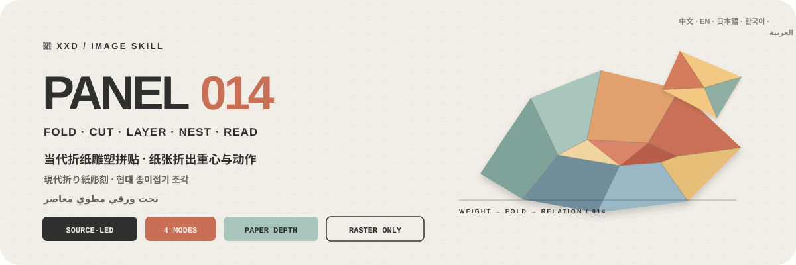

<p align="center">
  
</p>

<div align="center">

# 🦁 XXD Panel 014

### 把照片重构成真实可感的当代折纸雕塑

[](./SKILL.md)
[](#四种输出共享同一种纸艺雕塑逻辑)
[](#边界与信任)

<strong>简体中文</strong> · <a href="README.en.md">English</a> · <a href="README.ja.md">日本語</a> · <a href="README.ko.md">한국어</a> · <a href="README.ar.md">العربية</a>

</div>

> 折叠与切面 · 层叠与嵌套 · 源图重心构图 · 真实纸纤维 · 可读纸艺文字

XXD Panel 014 是一个面向 Codex 与兼容 Agent 的图像生成 Skill。它保留主体身份、轮廓、姿态与叙事关系，再通过折叠、切面、层叠、嵌套、遮挡和纸片拼接，把源图重构为一件一眼可辨、具有真实手工造物感的当代纸艺雕塑。

构图跟随源图的视觉重心、轮廓走势、体量比例与动作方向，而不是固定居中。源图色彩被转化为协调鲜明的纸张色组；柔和漫射光让纸纤维、折痕、切边、厚度、层间距离和自然阴影都真实成立。主文字同样由折纸或切纸构成，并成为空间结构的一部分。

## 为什么需要 014

普通“折纸风”很容易退化成低多边形 CG、儿童手工、塑料 3D、平均对称，或把纸鹤、纸花等通用符号套在任何照片上。

014 的顺序完全相反：

```text
锁定身份／轮廓／姿态／关系 → 读取重心、体量与动作方向 → 建立源图专属折叠图谱 → 用折面、切边、层叠、嵌套和负形概括主体 → 以层级、轴线、三角稳定、对角张力和遮挡组织唯一焦点 → 转译源图纸张色组 → 让可读主文字成为纸艺空间结构
```

如果换成一张无关照片，雕塑轮廓、折叠图谱、重心分布、纸张色组、辅助纸片和文字关系仍然成立，这张图就不属于 014。

## 014 的视觉契约

- **源图身份：** 至少三个专属线索保住轮廓、姿态、动作、结构、尺度、负形与关系。
- **真实纸构：** 折叠、切面、层叠、嵌套、穿插、遮挡与接合具有物理可信度，不是平滑低多边形。
- **源图构图：** 根据重心、轮廓、体量与方向选择偏心、裁切、延展或悬置；不机械居中和平均对称。
- **唯一焦点：** 主次层级、尺度对比、轴线、三角稳定、对角张力与正负形共同支撑一个主雕塑，辅助纸片不争焦点。
- **源图纸张色组：** 同色深浅、邻近色与极少量对比色区分折面和空间，背景保持米白、浅灰、柔和粉彩或相容浅色。
- **真实材质：** 柔和漫射光清楚表现纸纤维、折痕、切边、厚度、层间分离和自然阴影。
- **纸艺文字：** 一个短词或标题通过环绕、延伸、贴合、承托、穿插、叠压或悬置成为可读空间结构。

## 样张 · 即将补充

项目已预留 [`assets/examples/`](assets/examples/) 样张目录。只有经项目作者确认、确实使用 014 完成的作品才会加入；在此之前不借用其他风格的推文或图片作为占位。

未来样张只用于展示 014 对不同题材的适应力，不会把样张主体、隐喻、配色、文案或画幅变成生成参考或默认值。

## 四种输出共享同一种纸艺雕塑逻辑

四种模式支持单选或多选。可回复 `1`、`1+3`、`1、2、4` 或 `全部`；Skill 去重后按 1→4 执行。每种模式独立输出并进入独立子文件夹，不制作总图；`全部` 每张原图得到 7 个 PNG（前三种各 1 张＋壁纸 4 张）。尺寸可在同一回复中按模式标注，未标注普通模式按源图适配；文案默认跨所选模式共用，也可按模式单独指定。

| 模式 | 尺寸逻辑 | 成品 |
| --- | --- | --- |
| `top-bottom` | 源图自适应 | 上方完整原图，下方 014 当代折纸雕塑；两块都保持原图完整尺寸，严格 50/50 |
| `left-right` | 源图自适应 | 左侧完整原图，右侧 014 当代折纸雕塑；两块都保持原图完整尺寸，严格 50/50 |
| `design-only` | 源图自适应 | 只显示变化设计，不显示原照片；沿用原图比例和尺寸 |
| `wallpaper-pack` | 四种设备尺寸 | 分别输出手机、iPad、电脑、儿童手表四张 PNG |

用户精确尺寸 > 指定比例或用途 > 普通模式源图自适应。原始 `014.md` 里的 3:4 只是一开始的创作画幅，不会被写成当前 Skill 的静默默认值。

双联模式的摄影区域保持真实，只允许克制调色和必要的环境扩展。纯设计版与壁纸仍以照片为事实依据，但不显示原片。

### 四端壁纸：连贯或独立

壁纸没有静默尺寸默认。可选择常用预设——手机 `1440×3200`、iPad `2048×2732`、电脑 `3840×2160`、儿童手表 `1024×1024`——也可逐设备自定义。

- **连贯套装（推荐）：** 先生成并验收 iPad 定调图，另外三张都直接参考原照片＋同一张定调图，分别为设备重新构图。
- **四张独立：** 每张只参考原照片，可以探索不同的雕塑尺度、偏心位置、折面节奏、纸张色组、辅助纸片与文字关系。

连贯不等于裁切。四张壁纸始终分别生成、分别构图、分别验收，也不会按 iPad→手机→电脑→手表顺序垫图造成漂移。

## 文字本身就是纸艺空间结构

正式生图前，先选择自动文案、自定义文案或无文字。有文字时还要指定目标语言或地区。

自动文案从主体身份、主题、动作、情绪、关系或有依据的象征意义中提炼一个短词或标题，仅在有用时增加极少量编号、地点、状态词或微型注释。

地点、日期、出处和事实编号必须由用户提供或可靠确认，不会为了显得精致而伪造。主文字根据主体结构选择拱形环绕、沿轴线延伸、贴合轮廓、上下承托、穿插层间、叠压前后空间或悬置留白；文案仍需通过换图测试。

用户提供最终成稿时逐字保留。用户提供的是方向或可编辑草稿时，才会在保留受众、目的、必备词、语气和潜台词的前提下专业深化。

语言遵循目标受众，而不是用户下指令时使用的语言：

```text
目标市场或受众 > 指定成品语言 > 用户方向语言；都不明确时生图前询问
```

日本版使用自然日语，韩国受众使用自然韩语与正确空格，英国版使用英式英语，阿拉伯语版默认使用自然的现代标准阿拉伯语和真正的从右到左排版。纸艺字形会尊重各文字系统的比例、连接、方向与可读性，不把拉丁方块折字强套过去。

## 精确拼版交给代码，作品交给图像生成

图像模型负责源图绑定的纸艺主体、折面、切边、层叠、嵌套、纸张色组、真实材质光影与纸艺文字。`scripts/compose_panel.py` 只负责画布规划、精确 50/50 位图拼合、最终尺寸和审计，不会用程序绘图伪造成品。

```bash
python3 scripts/compose_panel.py --plan --layout top-bottom --source photo.png
python3 scripts/compose_panel.py --plan --layout left-right --size 2560x1440
python3 scripts/compose_panel.py --audit result.png --layout design-only --size 2048x2048
```

精确上下画布的总高度必须为偶数，精确左右画布的总宽度必须为偶数。Skill 不会静默修改用户指定的像素。

## 开始使用

```bash
git clone https://github.com/nevertoday/xxd-panel-014.git
mkdir -p ~/.codex/skills
ln -s "$(pwd)/xxd-panel-014" ~/.codex/skills/xxd-panel-014
```

Claude Code 用户可以把同一目录链接到 `~/.claude/skills/xxd-panel-014`。安装后重新启动 Agent 会话。

```text
$xxd-panel-014
把这张照片做成左右双联，文案由你根据照片内涵创作，使用自然韩语。
```

只上传照片也可以调用。Skill 会先用分行编号菜单询问一个或多个模式，再询问文字设置；选择壁纸时还会确认连贯或独立以及设备尺寸。

完整规范：

- [Skill 工作流](SKILL.md)
- [中文完整提示词](references/xxd-panel-014-prompt.zh-CN.md)
- [英文完整提示词](references/xxd-panel-014-prompt.en.md)
- [原始风格提示词](references/014-source.md)

## 边界与信任

- 每张照片只在自己的任务中使用，不借用其他输入、旧成品或样张里的主体、颜色、文案和构图。
- 每次调用都创建新的任务子文件夹；相同原图和参数也要重新生成，旧成品不能冒充当前任务。
- 最终交付为 PNG 位图，不是 SVG、HTML、Canvas 或程序绘图替代品。
- 已配置位图桥接只返回脱敏状态，不显示供应商、端点、请求头、凭据、提示词或服务器响应正文。
- 每个所选普通模式各返回一张；若选择 `wallpaper-pack`，再返回四张独立壁纸。选择 `全部` 时每张原图共返回 7 个 PNG，分处四个同级模式文件夹，绝不生成拼贴总览。

本地拼版需要 Python 3 和 Pillow。安全位图桥接使用 Python 3.11+ 的 `tomllib`。图像生成仍需要主机 Agent 的内置位图能力或已经配置好的兼容位图路径。

## 项目结构

```text
xxd-panel-014/
├── SKILL.md
├── README.md / README.en.md / README.ja.md / README.ko.md / README.ar.md
├── agents/openai.yaml
├── assets/
│   ├── banner.svg
│   └── examples/（未来本地样张占位）
├── scripts/
│   ├── compose_panel.py
│   └── configured_imagegen.py
└── references/
    ├── xxd-panel-014-prompt.zh-CN.md
    ├── xxd-panel-014-prompt.en.md
    └── 014-source.md
```

## 关于 XXD

XXD 是小小东的品牌名称缩写。项目由 [@xiaoxiaodong01](https://x.com/xiaoxiaodong01) 创建并维护。

## 服务与会员

### 深度咨询 · 299 元/小时

Skills 使用的一对一深度咨询按 299 元/小时收费。请通过下方微信二维码联系小小东预约。

### 小小东 Skills 用户交流群 · 入群 99 元

一次支付 99 元加入用户交流群，用于交流工作流、作品与互助；不包含按小时的一对一深度咨询。扫码后请备注“Skills 用户交流群”。

### 知识星球＋成员提示词库 · 699 元/年

[知识星球](https://wx.zsxq.com/group/15554814142882)与[小小东成员提示词库](https://vip.xiaoxiaodong.ai/)是同一份会员权益：**一次年费同时开通两边，无需重复付费。**

1. 在[知识星球](https://wx.zsxq.com/group/15554814142882)开通后，微信联系小小东领取成员提示词库兑换码。
2. 在[成员提示词库](https://vip.xiaoxiaodong.ai/)自助开通后，微信联系小小东邀请进入知识星球。

<p align="center">
  <a href="https://xiaoxiaodong.pages.dev/assets/wechat-qr.png"></a>
</p>

<div align="center">

**不是把照片变成低多边形，而是让纸张真的折出它的重心、动作与关系。**

</div>

---

<div align="center">
  <h2>☕ 为开源项目赞助算力</h2>
  <p>如果这个项目为你节省了时间，可以通过微信或支付宝赞助后续测试与生成算力。</p>
  <table>
    <tr>
      <td align="center" width="240">
        <a href="https://colors.xiaoxiaodong.ai/docs/images/wechat-reward-qr.png"></a><br>
        <strong>微信算力赞助</strong>
      </td>
      <td align="center" width="240">
        <a href="https://colors.xiaoxiaodong.ai/docs/images/alipay-reward-qr.png"></a><br>
        <strong>支付宝算力赞助</strong>
      </td>
    </tr>
  </table>
  <p><sub>赞助完全自愿，不会改变这个开源项目的使用权限。</sub></p>
</div>
